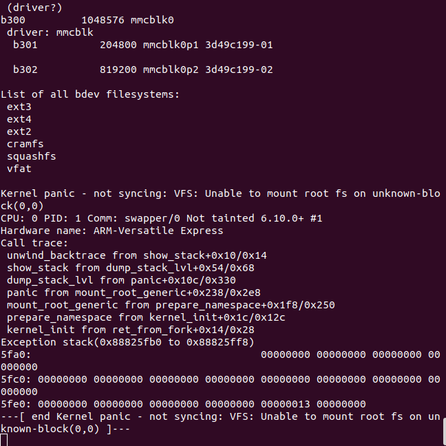

to use bootflow scan 

we create dir extlinux and add the extlinux.conf 

`mkdir extlinux `

`cd extlinux`

`touch extlinux.conf`

then configure the file with image and fdt file path 

LABEL myextconf
    KERNEL ../zImage
    FDT ../fdt.dtb

then edit bootcmd to run bootflow scan 

`editenv bootcmd`

`bootflow scan`

`save env`

then when we restart qemu we get   kernel panic

