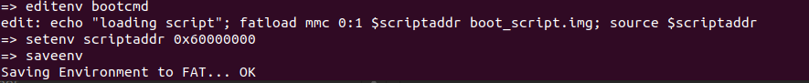

first mount the virtual sd card 

` sudo losetup -f --show --partscan sd.img`

then partition the virtual sd card 

`sudo mkfs.vfat -F 16 -n boot /dev/loop22p1`

`sudo mkfs.ext4 -L rootfs /dev/loop22p2`

then mount them
` sudo mount /dev/loop22p1 ~/boot`

 `sudo mount /dev/loop22p2 ~/rootfs`

then we create 2 files zImage and fdt.dtb 

also in sd card we create the script if there is a mmc device it load image and dtb file from sd card 

the script must be image so that uboot can execute it 

`sudo mkimage -A arm -T script -C none -n 'Boot script' -d ./script ./boot_script.img`

also we should edit the bootcmd so that it loads the script into ram and execute it 

so when we run qemu 

to boot from server using tftp 

a script to configure hoat machine to tap interface 

`#!/bin/sh
ip a add 192.168.43.57/24 dev $1
ip link set $1 up`

we set env vars in qemu to configure connection 

set serveraddr and ipaddr for qemu

and load zIamge and fdt 

the zImage and fdt must be at /srv/fttp

getting the image and fdt 

finally the script 

