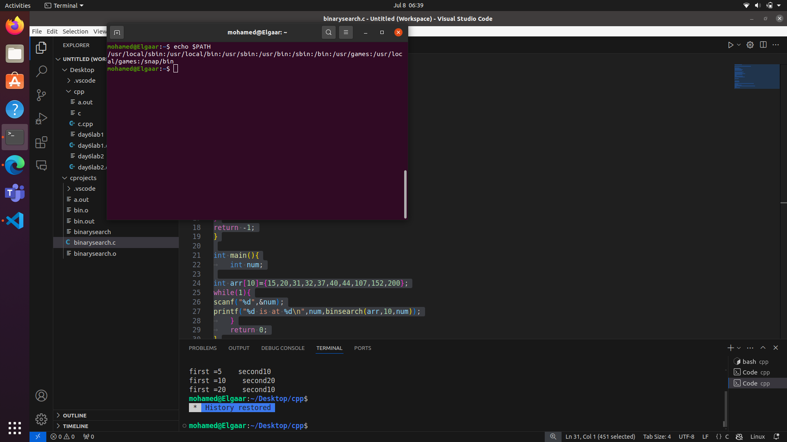

# QUESTION2

it will be executed from any location because when shell passes the process to the kernel it will search for it in the PATH and since /usr/local/bin is included

it will find it and execute it anywhere 

	
