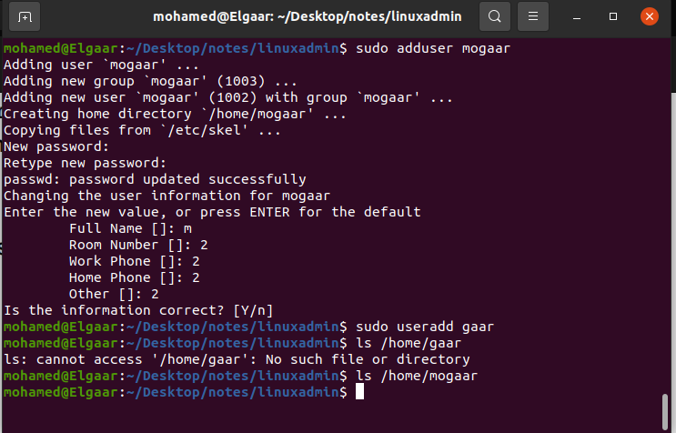

# section2

1.`sudo groupadd -g 30000 pgroup` 

2.`sudo passwd --lock username`

3.`sudo userdel username`

4.`sudo groupdel groupname`

5.adduser is higher level command it provides interactive setup by default adduser sets up default configurations like creating home directory and copy config files such as .bashrc and .profile 

which useradd does not do unless specified with flags 

